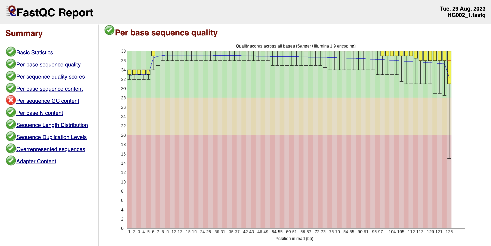

# Pre-processing {#align}

## Sarek Pipeline

We execute the raw read pre-processing with the Sarek pipeline using Nextflow.

```{bash eval=FALSE}
module load nextflow/23.04.3
exome=sureselectV5_padded_hg38.bed
nextflow run nf-core-sarek-3.1.2/workflow \
-profile singularity,beluga --input ./samplesheet_ec.csv --outdir ./results \
--genome GATK.GRCh38 --intervals $exome \
--wes --nucleotides_per_second 1000 --save_reference --save_output_as_bam --save_mapped
```

In the following we describe the tools that the command calls with their associated scripts.

## Quality Control of Raw Reads

We obtain an overview of the quality of the raw reads with [FastQC](http://www.bioinformatics.babraham.ac.uk/projects/fastqc/).

```{bash eval=FALSE}
module load fastqc/0.11.9
fastqc -t 6 AJ_GIAB_fastq/HG002_1.fastq AJ_GIAB_fastq/HG002_2.fastq
```



## Alignment

We trim raw reads with [fastp](https://github.com/OpenGene/fastp), then map reads to the GRCh38 reference genome with the BWA-MEM algorithm and convert SAM to BAM with samtools.

```{bash eval=FALSE}
module load fastp/0.23.4
module load bwa
module load samtools
export reference=$MUGQIC_INSTALL_HOME/genomes/species/Homo_sapiens.GRCh38/
id=""
sm="HG002"
genome/bwa_index/Homo_sapiens.GRCh38.fa
fastp -i HG002_1.fq.gz -I HG002_2.fq.gz \
    --stdout --thread 2 \
    -j "fastp-HG002.json" \
    -h "fastp-HG002.html" \
    2> "fastp-HG002.log" \
| bwa mem -v 2 -M -t 32 -p \
    -R "@RG\tID:$id\tPL:ILLUMINA\tLB:$id"_"$sm\tSM:$sm" \
    $reference - 2> "bwa-HG002.log" \
| samtools view -@ 16 \
    -O BAM \
    -o "aligned_HG002.bam" \
    2> "samtools-HG002.log"
```

## Mark Duplicates

We identify read pairs that are likely to have originated from duplicates of the same DNA fragment with GATK MarkDuplicates.

```{bash eval=FALSE}
export GATK_JAR=/cvmfs/soft.mugqic/CentOS6/software/GenomeAnalysisTK/GenomeAnalysisTK-4.1.8.1/gatk-package-4.1.8.1-local.jar
java -Xms60G -Xmx60G -jar $GATK_JAR MarkDuplicatesSpark \
  -I aligned_HG002.bam \
  -O aligned_HG002_markdup.bam \
  --spark-master local[12]
```

## Base Quality Score Recalibration

We use BQSR to recalibrate the base quality of reads based on on various covariates, i.e., read group, reported quality score, machine cycle, and nucleotide context.

```{bash eval=FALSE}
java -Xms4G -Xmx4G -jar $GATK_JAR BaseRecalibrator \
  -I aligned_HG002_markdup.bam \
  -R $reference \
  -O aligned_HG002_markdup_bqsr.report \
  --known-sites BQSR/Homo_sapiens_assembly38.dbsnp138.vcf \
  --known-sites BQSR/Homo_sapiens_assembly38.known_indels.vcf.gz \
  --known-sites BQSR/Mills_and_1000G_gold_standard.indels.hg38.vcf.gz

java -Xms2G -Xmx2G -jar $GATK_JAR ApplyBQSR \
  -I aligned_HG002_markdup.bam \
  -R $reference \
  --bqsr-recal-file aligned_HG002_markdup_bqsr.report \
  -O aligned_HG002_markdup_bqsr.bam
```

## Quality Control of Alignment

[samtools stats](https://www.htslib.org/doc/samtools.html) collects statistics from BAM files and outputs in a text format.

```{bash eval=FALSE}
samtools stats aligned_HG002_markdup_bqsr.bam > aligned_HG002_markdup_bqsr_stats.txt
```

[Mosdepth](https://github.com/brentp/mosdepth) summarizes basic statistics of the alignment (number of reads, coverage, GC-content, etc.) and produces a number of useful graphs.

```{bash eval=FALSE}
module load mugqic/mosdepth/0.3.4
mosdepth --by $exome HG002_mosdepth_output aligned_HG002_markdup_bqsr.bam
```

[MultiQC](http://multiqc.info/) generates a single HTML report summarizing all samples in the project.

```{bash eval=FALSE}
module load multiqc
multiqc .
```

